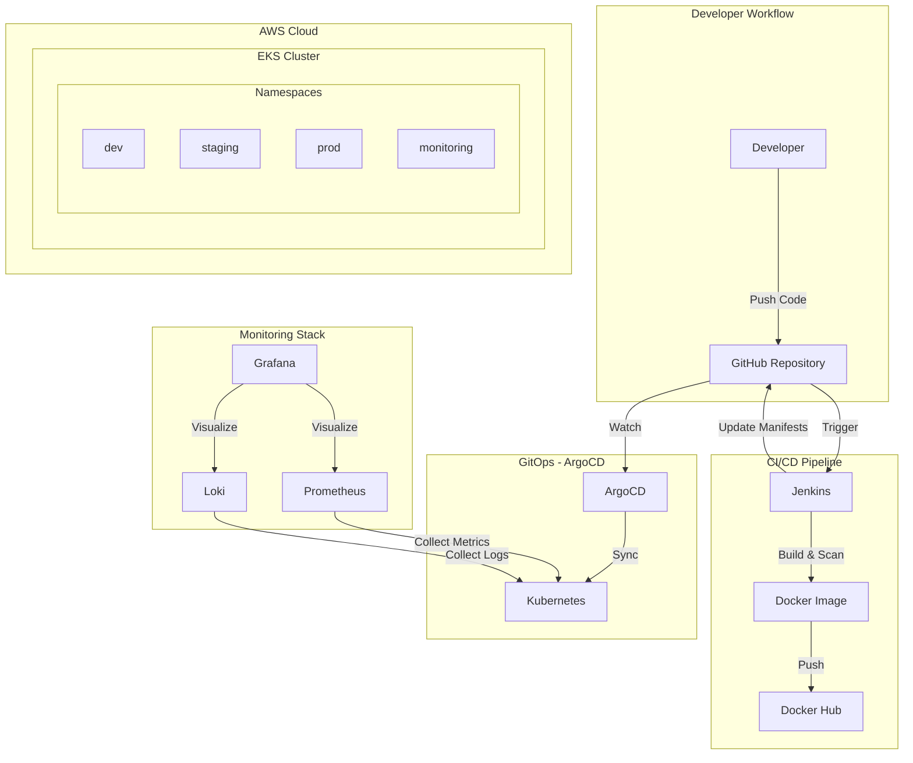

# 🚀 Monolithic DevOps Project

A comprehensive **GitOps-based DevOps infrastructure** for the `backend-manga2you` application, featuring automated deployments, multi-environment support, infrastructure as code, and full observability.

---

## 📋 Table of Contents

- [Project Overview](#-project-overview)
- [Architecture](#-architecture)
- [Technology Stack](#-technology-stack)
- [Project Structure](#-project-structure)
- [Infrastructure Components](#-infrastructure-components)
- [Environment Management](#-environment-management)
- [Monitoring & Observability](#-monitoring--observability)
- [CI/CD Pipeline](#-cicd-pipeline)
- [Getting Started](#-getting-started)
- [Configuration](#-configuration)
- [Security Features](#-security-features)

---

## 🎯 Project Overview

This project implements a complete **end-to-end DevOps pipeline** for a containerized backend application. It leverages:

- **GitOps** for declarative, version-controlled deployments via ArgoCD
- **Kustomize** for environment-specific Kubernetes configurations
- **Terraform** for AWS infrastructure provisioning (VPC, EKS, IAM)
- **Prometheus & Loki** for comprehensive monitoring and logging
- **Jenkins** for CI pipeline with integrated security scanning

---

## 🏗 Architecture



---

## 🛠 Technology Stack

| Category | Technology | Version | Purpose |
|----------|------------|---------|---------|
| **Cloud Provider** | AWS | - | Cloud infrastructure |
| **Container Orchestration** | Amazon EKS | - | Managed Kubernetes |
| **GitOps** | ArgoCD | 9.2.2 | Continuous Deployment |
| **IaC** | Terraform | - | Infrastructure provisioning |
| **Configuration** | Kustomize | v1beta1 | Environment customization |
| **Monitoring** | Prometheus | 65.8.1 (kube-prometheus-stack) | Metrics collection |
| **Logging** | Loki Stack | 2.10.3 | Log aggregation |
| **CI Server** | Jenkins | 2.414.2 | Continuous Integration |
| **Container Runtime** | Docker | - | Containerization |
| **Security Scanning** | Trivy, Snyk, Semgrep | Latest | Vulnerability scanning |

---

## 📂 Project Structure

```
devops_project/
├── 📂 argocd/
│   └── applications/
│       ├── argocd-dev.yaml          # Dev environment application
│       ├── argocd-staging.yaml      # Staging environment application
│       ├── argocd-prod.yaml         # Production environment application
│       ├── argocd-observation.yaml  # Loki monitoring stack
│       └── argocd-mimir.yaml        # Prometheus monitoring stack
│
├── 📂 infrastructure/
│   ├── base/                        # Base Kubernetes manifests
│   │   ├── deployment.yaml          # Application deployment
│   │   ├── service.yaml             # Service definition
│   │   ├── HPA.yaml                 # Horizontal Pod Autoscaler
│   │   ├── kustomization.yaml       # Kustomize base config
│   │   ├── config.properties        # Environment variables
│   │   ├── network-engine/          # Network policies
│   │   ├── policy/                  # Pod security policies
│   │   └── rbac/backend/            # RBAC configurations
│   │       ├── sa.yaml              # ServiceAccount
│   │       ├── role.yaml            # Role definition
│   │       └── role-biding.yaml     # RoleBinding
│   ├── overlays/                    # Environment-specific overrides
│   │   ├── dev/                     # Development overlay
│   │   ├── staging/                 # Staging overlay (with k6 tests)
│   │   └── prod/                    # Production overlay
│   └── metrics-server/              # Metrics Server deployment
│
├── 📂 monitoring/
│   ├── loki-values.yaml             # Loki Helm chart values
│   └── mimir-values.yaml            # Prometheus Helm chart values
│
├── 📂 terraform/
│   ├── main.tf                      # Main Terraform configuration
│   ├── providers.tf                 # Provider definitions
│   ├── locals.tf                    # Local variables
│   ├── modules/
│   │   ├── vpc/                     # VPC module
│   │   ├── eks/                     # EKS cluster module
│   │   └── iam/                     # IAM roles and policies
│   │       ├── attachment/          # Policy attachments
│   │       ├── policy/              # Custom policies
│   │       ├── role/                # IAM roles
│   │       └── user/                # IAM users
│   └── values/                      # Helm values for Terraform
│
├── 📂 jenkins/
│   ├── Dockerfile                   # Custom Jenkins agent image
│   ├── docker-compose.yaml          # Jenkins deployment config
│   └── jenkins_backend_manga2you    # SSH keys
│
├── 📂 dockerfiles/
│   └── Dockerfile                   # Application Dockerfile
│
└── 📂 cleaning/                     # Cleanup scripts
```

---

## 🏛 Infrastructure Components

### AWS Infrastructure (Terraform)

The Terraform configuration provisions a complete AWS infrastructure:

| Component | Configuration | Description |
|-----------|---------------|-------------|
| **VPC** | CIDR: `10.0.0.0/16` | Isolated network for the cluster |
| **Public Subnets** | `10.0.1.0/24`, `10.0.2.0/24` | For load balancers and NAT |
| **Private Subnets** | `10.0.3.0/24`, `10.0.4.0/24` | For worker nodes |
| **Availability Zones** | `us-east-1a`, `us-east-1b` | High availability setup |
| **EKS Cluster** | Managed worker nodes | Container orchestration |

### Helm Releases (via Terraform)

| Release | Chart | Namespace | Purpose |
|---------|-------|-----------|---------|
| **Metrics Server** | metrics-server (v3.12.1) | kube-system | Enable HPA metrics |
| **Cluster Autoscaler** | cluster-autoscaler (v9.37.0) | kube-system | Node auto-scaling |
| **ArgoCD** | argo-cd (v9.2.2) | argocd | GitOps deployments |

---

## 🌍 Environment Management

This project uses **Kustomize overlays** to manage multiple environments with a single base configuration:

### Base Configuration

The base layer defines common resources:
- **Deployment** with ServiceAccount integration
- **Service** (ClusterIP) on port 9632
- **HorizontalPodAutoscaler** (1-4 replicas, 70% CPU target)
- **RBAC** (ServiceAccount, Role, RoleBinding for pod access)

### Environment Overlays

| Environment | Namespace | Prefix | Features |
|-------------|-----------|--------|----------|
| **Development** | `dev` | `dev-` | Metrics Server enabled |
| **Staging** | `staging` | `staging-` | Metrics Server + k6 load testing |
| **Production** | `prod` | `prod-` | Enhanced HPA, Metrics Server |

Each overlay provides:
- Environment-specific namespace isolation
- Custom ConfigMap generation
- Patch files for Deployment, Service, and HPA resources
- Name prefixes/suffixes for resource identification

---

## 📊 Monitoring & Observability

### Prometheus Stack

Deployed via ArgoCD with optimized resource settings for academic/development use:

| Component | Resources (Request/Limit) | Purpose |
|-----------|---------------------------|---------|
| **Prometheus** | 200m/1 CPU, 512Mi/1Gi RAM | Metrics collection |
| **Node Exporter** | 20m/100m CPU, 30Mi/50Mi RAM | Node metrics |
| **Kube State Metrics** | 20m/100m CPU, 50Mi/100Mi RAM | Kubernetes object metrics |
| **Prometheus Operator** | 50m/200m CPU, 50Mi/100Mi RAM | Operator management |

**Configuration highlights:**
- 7-day data retention with 10GB size limit
- 60-second scrape interval (optimized for resource usage)
- Essential default rules enabled (k8s, apps, nodes)

### Loki Stack

Log aggregation deployed alongside Prometheus:
- Collects logs from all pods
- Integrates with Grafana for visualization
- Deployed in `monitoring` namespace

---

## 🔄 CI/CD Pipeline

### Jenkins Setup

Custom Jenkins agent with pre-installed security tools:

```dockerfile
# Tools included:
- Git
- Maven
- Docker
- Python3
- Node.js & npm
- Snyk CLI (Dependency scanning)
- Trivy (Container scanning)
- Semgrep (SAST)
```

### GitOps Flow (ArgoCD)

ArgoCD applications are configured with:

| Setting | Value | Description |
|---------|-------|-------------|
| **Sync Policy** | Automated | Auto-sync on Git changes |
| **Self-Heal** | Enabled | Auto-fix drift from Git state |
| **Prune** | Enabled | Remove orphaned resources |
| **CreateNamespace** | True | Auto-create namespaces |

---

## 🚀 Getting Started

### Prerequisites

- AWS CLI configured with appropriate credentials
- Terraform >= 1.0
- kubectl
- Docker
- Helm 3.x

### Deployment Steps

1. **Provision AWS Infrastructure**
   ```bash
   cd terraform
   terraform init
   terraform plan
   terraform apply
   ```

2. **Configure kubectl**
   ```bash
   aws eks update-kubeconfig --name <cluster-name> --region us-east-1
   ```

3. **Access ArgoCD**
   ```bash
   # Get initial admin password
   kubectl -n argocd get secret argocd-initial-admin-secret -o jsonpath="{.data.password}" | base64 -d
   
   # Port-forward to access UI
   kubectl port-forward svc/argocd-server -n argocd 8080:443
   ```

4. **Deploy Applications**
   ```bash
   # Apply ArgoCD application manifests
   kubectl apply -f argocd/applications/
   ```

### Local Jenkins Setup

```bash
cd jenkins
docker network create jenkins
docker build -t myjenkins-blueocean:2.414.2 .
docker-compose up -d
```

---

## ⚙️ Configuration

### Application Configuration

Environment variables are managed through ConfigMaps:

| Variable | Location | Description |
|----------|----------|-------------|
| Base config | `infrastructure/base/config.properties` | Common settings |
| Dev config | `infrastructure/overlays/dev/config.properties` | Development overrides |
| Staging config | `infrastructure/overlays/staging/config.properties` | Staging overrides |
| Production config | `infrastructure/overlays/prod/config.properties` | Production overrides |

### Scaling Configuration

**Horizontal Pod Autoscaler (HPA):**
- **Minimum replicas:** 1
- **Maximum replicas:** 4
- **Target CPU utilization:** 70%

---

## 🔒 Security Features

### Container Security

| Feature | Implementation | Description |
|---------|----------------|-------------|
| **Non-root user** | Dockerfile | App runs as `read-user` |
| **Read-only group** | Dockerfile | `read-group` for minimal permissions |
| **Root disabled** | `chsh -s /usr/sbin/nologin root` | Prevents root shell access |

### Kubernetes RBAC

| Resource | Name | Permissions |
|----------|------|-------------|
| **ServiceAccount** | `backend-sa` | Identity for pods |
| **Role** | `backend-role` | `get`, `list` on pods |
| **RoleBinding** | `sa-backend-rb` | Binds SA to Role |

### CI Security Scanning

- **Snyk** - Dependency vulnerability scanning
- **Trivy** - Container image vulnerability scanning
- **Semgrep** - Static Application Security Testing (SAST)

---

## 📝 License

This project is developed for academic purposes as part of a DevOps project.

---

## 👥 Contributors

- **Saber Benhamda** - DevOps Engineer

---

<div align="center">

**Built with ❤️ using modern DevOps practices**

[](https://kubernetes.io/)
[](https://argoproj.github.io/cd/)
[](https://www.terraform.io/)
[](https://aws.amazon.com/)
[](https://www.docker.com/)
[](https://www.jenkins.io/)

</div>
