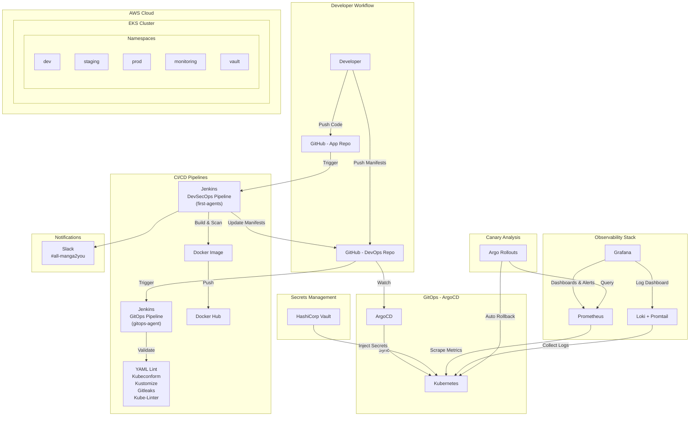
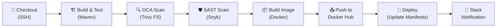
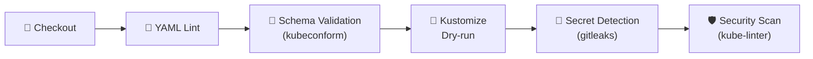
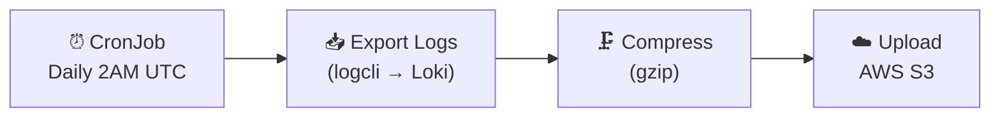

# 🚀 Monolithic DevOps Project

A comprehensive **GitOps-based DevSecOps infrastructure** for the `backend-manga2you` application, featuring dual CI/CD pipelines, canary deployments with automated analysis, secrets management via HashiCorp Vault, and full observability with alerting.

---

## 📋 Table of Contents

- [Project Overview](#-project-overview)
- [Architecture](#-architecture)
- [Technology Stack](#-technology-stack)
- [Project Structure](#-project-structure)
- [CI/CD Pipelines](#-cicd-pipelines)
- [Infrastructure Components](#-infrastructure-components)
- [Environment Management](#-environment-management)
- [Canary Deployments](#-canary-deployments)
- [Secrets Management (Vault)](#-secrets-management-vault)
- [Monitoring & Observability](#-monitoring--observability)
- [Log Archival (CronJob)](#-log-archival-cronjob)
- [Security Features](#-security-features)
- [Getting Started](#-getting-started)
- [Configuration](#-configuration)

---

## 🎯 Project Overview

This project implements a complete **end-to-end DevSecOps platform** for a containerized Spring Boot backend application. It leverages:

- **Dual CI/CD Pipelines** — A DevSecOps pipeline for building, scanning, and deploying, and a GitOps pipeline for validating Kubernetes manifests
- **GitOps** for declarative, version-controlled deployments via ArgoCD
- **Canary Deployments** with Argo Rollouts and automated Prometheus-based analysis
- **Kustomize** for environment-specific Kubernetes configurations (dev, staging, prod)
- **Terraform** for AWS infrastructure provisioning (VPC, EKS, IAM)
- **HashiCorp Vault** for Kubernetes-native secrets management
- **Prometheus, Loki & Grafana** for metrics, logging, alerting, and dashboards (4xx/5xx tracking)
- **Jenkins** with Docker-Compose and dedicated agents per pipeline

---

## 🏗 Architecture


```mermaid
flowchart TB
    subgraph "Developer Workflow"
        DEV[Developer] -->|Push Code| GH_APP[GitHub - App Repo]
        DEV -->|Push Manifests| GH_OPS[GitHub - DevOps Repo]
    end

    subgraph "CI/CD Pipelines"
        GH_APP -->|Trigger| JEN_DEV["Jenkins<br/>DevSecOps Pipeline<br/>(first-agents)"]
        GH_OPS -->|Trigger| JEN_GIT["Jenkins<br/>GitOps Pipeline<br/>(gitops-agent)"]
        JEN_DEV -->|Build & Scan| DOCK[Docker Image]
        DOCK -->|Push| DHB[Docker Hub]
        JEN_DEV -->|Update Manifests| GH_OPS
        JEN_GIT -->|Validate| VALID["YAML Lint<br/>Kubeconform<br/>Kustomize<br/>Gitleaks<br/>Kube-Linter"]
    end

    subgraph "GitOps - ArgoCD"
        GH_OPS -->|Watch| ARGO[ArgoCD]
        ARGO -->|Sync| K8S
    end

    subgraph "AWS Cloud"
        subgraph "EKS Cluster"
            K8S[Kubernetes]
            subgraph "Namespaces"
                DEV_NS[dev]
                STG_NS[staging]
                PROD_NS[prod]
                MON_NS[monitoring]
                VAULT_NS[vault]
            end
        end
    end

    subgraph "Secrets Management"
        VAULT[HashiCorp Vault] -->|Inject Secrets| K8S
    end

    subgraph "Observability Stack"
        PROM[Prometheus] -->|Scrape Metrics| K8S
        LOKI[Loki + Promtail] -->|Collect Logs| K8S
        GRAF[Grafana] -->|Dashboards & Alerts| PROM
        GRAF -->|Log Dashboard| LOKI
    end

    subgraph "Canary Analysis"
        ARGO_ROLL[Argo Rollouts] -->|Query| PROM
        ARGO_ROLL -->|Auto Rollback| K8S
    end

    subgraph "Notifications"
        S["Slack<br/>#all-manga2you"]
    end

    JEN_DEV --> S
```

---

## 🛠 Technology Stack

| Category | Technology | Version | Purpose |
|----------|------------|---------|---------|
| **Cloud Provider** | AWS | - | Cloud infrastructure |
| **Container Orchestration** | Amazon EKS | - | Managed Kubernetes |
| **GitOps** | ArgoCD | 9.2.2 | Continuous Deployment |
| **Progressive Delivery** | Argo Rollouts | - | Canary deployments with automated analysis |
| **IaC** | Terraform | - | Infrastructure provisioning |
| **Configuration** | Kustomize | v1beta1 | Environment customization |
| **Monitoring** | Prometheus | 65.8.1 (kube-prometheus-stack) | Metrics collection & alerting |
| **Logging** | Loki Stack | 2.10.3 | Log aggregation |
| **Visualization** | Grafana | latest | Dashboards for metrics, logs, 4xx/5xx codes |
| **Secrets** | HashiCorp Vault | 0.32.0 | Kubernetes-native secrets management |
| **CI Server** | Jenkins | 2.414.2 | Continuous Integration (Docker-Compose) |
| **Container Runtime** | Docker | - | Containerization |
| **Security Scanning** | Trivy, Snyk, Semgrep | Latest | Vulnerability scanning |
| **Manifest Validation** | yamllint, kubeconform, kube-linter, gitleaks | Latest | GitOps manifest quality gates |
| **Ingress** | NGINX Ingress Controller | - | Traffic routing & canary traffic splitting |

---

## 📂 Project Structure

```
devops_project/
├── 📂 argocd/
│   └── applications/
│       ├── argocd-dev.yaml               # Dev environment ArgoCD app
│       ├── argocd-staging.yaml           # Staging environment ArgoCD app
│       ├── argocd-prod.yaml              # Production environment ArgoCD app
│       ├── argocd-observation.yaml       # Loki Stack (logging + Grafana)
│       ├── argocd-mimir.yaml             # kube-prometheus-stack (metrics)
│       └── argocd-vault.yaml             # HashiCorp Vault
│
├── 📂 infrastructure/
│   ├── base/                             # Base Kubernetes manifests
│   │   ├── deployment.yaml               # Application deployment
│   │   ├── service.yaml                  # Service definition
│   │   ├── hpa.yaml                      # Horizontal Pod Autoscaler
│   │   ├── ingress.yaml                  # NGINX Ingress
│   │   ├── kustomization.yaml            # Kustomize base config
│   │   ├── config.properties             # Environment variables
│   │   ├── network-engine/               # Network policies
│   │   ├── policy/                       # Pod security policies
│   │   └── rbac/                         # RBAC configurations
│   │       ├── sa.yaml                   # ServiceAccount
│   │       ├── role.yaml                 # Role definition
│   │       └── role-biding.yaml          # RoleBinding
│   ├── overlays/
│   │   ├── dev/                          # Development overlay
│   │   ├── staging/                      # Staging overlay (with k6 tests)
│   │   └── prod/                         # Production overlay
│   │       ├── canary-rollout.yaml       # Argo Rollouts canary strategy
│   │       ├── canary-service.yaml       # Canary service
│   │       ├── canary-ingress.yaml       # Canary ingress (NGINX weight-based)
│   │       ├── canary-validation-analysis-template.yaml  # Prometheus analysis
│   │       └── job/
│   │           └── logs-cron-job.yaml    # Log export CronJob to S3
│   └── metrics-server/                   # Metrics Server deployment
│
├── 📂 monitoring/
│   ├── loki-values.yaml                  # Loki + Promtail + Grafana Helm values
│   └── mimir-values.yaml                # kube-prometheus-stack Helm values
│
├── 📂 jenkins/
│   ├── docker-compose.yaml               # Jenkins server deployment
│   ├── devsecops-pipeline/
│   │   └── Jenkinsfile                   # DevSecOps CI pipeline (build, scan, deploy)
│   └── gitops-pipeline/
│       └── Jenkinsfile                   # GitOps validation pipeline (lint, validate)
│
├── 📂 dockerfiles/
│   ├── Dockerfile                        # Application Dockerfile
│   ├── devsecops-container/
│   │   └── Dockerfile                    # Jenkins agent: Trivy, Snyk, Semgrep, Maven, Docker
│   ├── gitops-cicd-container/
│   │   └── Dockerfile                    # Jenkins agent: yamllint, kubeconform, kustomize, gitleaks, kube-linter
│   └── cronjob-container/
│       └── Dockerfile                    # Log export container: logcli + aws-cli
│
├── 📂 terraform/
│   ├── main.tf                           # Main Terraform config (VPC, EKS, Helm releases)
│   ├── providers.tf                      # Provider definitions
│   ├── locals.tf                         # Local variables
│   ├── modules/
│   │   ├── vpc/                          # VPC module
│   │   ├── eks/                          # EKS cluster module
│   │   └── iam/                          # IAM roles and policies
│   │       ├── attachment/               # Policy attachments
│   │       ├── policy/                   # Custom policies
│   │       ├── role/                     # IAM roles
│   │       └── user/                     # IAM users
│   └── values/                           # Helm values for Terraform-managed releases
│
├── 📂 vault/
│   ├── vault-values.yaml                 # Vault Helm chart values
│   └── vault-init-configmap.yaml         # Init script: enable K8s auth, inject secrets
│
└── 📂 cleaning/                          # Cleanup scripts
```

---

## 🔄 CI/CD Pipelines

This project uses **two dedicated Jenkins pipelines**, each running on its own purpose-built agent.

### Pipeline 1: DevSecOps Pipeline

> **Agent:** `first-agents` (devsecops-container)
> **Trigger:** GitHub Push on the application repository

The DevSecOps pipeline handles building, security scanning, and deploying the application.


```mermaid
flowchart LR
    A["🔄 Checkout<br/>(SSH)"] --> B["🏗️ Build & Test<br/>(Maven)"]
    B --> C["🔍 OCA Scan<br/>(Trivy FS)"]
    C --> D["🛡️ SAST Scan<br/>(Snyk)"]
    D --> E["📦 Build Image<br/>(Docker)"]
    E --> F["📤 Push to<br/>Docker Hub"]
    F --> G["🚀 Deploy<br/>(Update Manifests)"]
    G --> H["🔔 Slack<br/>Notification"]
```

| Stage | Tool | Description | Failure Action |
|-------|------|-------------|----------------|
| **Checkout** | Git + SSH | Clone source code from GitHub | — |
| **Build & Unit Tests** | Maven | `mvn clean install` — compile and run tests | Slack alert |
| **OCA Scan** | Trivy | Filesystem scan for HIGH/CRITICAL vulnerabilities | Slack alert |
| **SAST Scan** | Snyk | Static analysis with high severity threshold | Slack alert |
| **Build Image** | Docker | Build container image with build number tag | — |
| **Push to Docker Hub** | Docker | Tag and push image to registry | — |
| **Deploy** | Git | Update `deployment.yaml` with new image tag and push to DevOps repo | — |

### Pipeline 2: GitOps Validation Pipeline

> **Agent:** `gitops-agent` (gitops-cicd-container)
> **Trigger:** GitHub Push on the DevOps manifests repository

The GitOps pipeline validates all Kubernetes manifests and infrastructure-as-code before ArgoCD syncs changes.


```mermaid
flowchart LR
    A["🔄 Checkout"] --> B["📝 YAML Lint"]
    B --> C["📐 Schema Validation<br/>(kubeconform)"]
    C --> D["🔧 Kustomize<br/>Dry-run"]
    D --> E["🔑 Secret Detection<br/>(gitleaks)"]
    E --> F["🛡️ Security Scan<br/>(kube-linter)"]
```

| Stage | Tool | Description |
|-------|------|-------------|
| **YAML Lint** | yamllint | Validate YAML syntax across prod overlays |
| **Schema Validation** | kubeconform | Validate manifests against Kubernetes API schemas |
| **Kustomize Dry-run** | kustomize | Build and verify Kustomize overlays render correctly |
| **Secret Detection** | gitleaks | Scan code and Git commit history for leaked secrets |
| **Security Scan** | kube-linter | Check manifests for security and best practice issues |

### Jenkins Agents (Dockerfiles)

| Agent | Base Image | Pre-installed Tools |
|-------|-----------|---------------------|
| **devsecops-container** | `jenkins/agent:latest` | Git, Maven, Docker, Python3, Node.js, Snyk CLI, Trivy, Semgrep |
| **gitops-cicd-container** | `ubuntu:22.04` | Git, Java 17, yamllint, kubeconform, kustomize, gitleaks, kube-linter |

### Jenkins Deployment

Jenkins runs via **Docker Compose** with the following setup:

```yaml
# jenkins/docker-compose.yaml
services:
  jenkins:
    image: myjenkins-blueocean:2.414.2
    ports: ["8080:8080"]
    volumes:
      - jenkins_volume:/var/jenkins_home
      - //./pipe/docker_engine:/var/run/docker.sock  # Windows
```

### Slack Notifications

| Event | Channel | Message |
|-------|---------|---------|
| **Pipeline Success** | `#all-manga2you` | ✅ Build success notification |
| **Pipeline Failure** | `#all-manga2you` | ❌ Build failure alert |
| **Trivy Scan Failure** | `#all-manga2you` | 🔴 Security vulnerability detected |
| **SAST Failure** | `#all-manga2you` | 🔴 SAST scan failed |
| **Unit Test Failure** | `#all-manga2you` | 🔴 Unit test failure alert |

---

## 🏛 Infrastructure Components

### AWS Infrastructure (Terraform)

| Component | Configuration | Description |
|-----------|---------------|-------------|
| **VPC** | CIDR: `10.0.0.0/16` | Isolated network for the cluster |
| **Public Subnets** | `10.0.1.0/24`, `10.0.2.0/24` | For load balancers and NAT |
| **Private Subnets** | `10.0.3.0/24`, `10.0.4.0/24` | For worker nodes |
| **Availability Zones** | `us-east-1a`, `us-east-1b` | High availability setup |
| **EKS Cluster** | Managed worker nodes | Container orchestration |

### Helm Releases (via Terraform)

| Release | Chart | Version | Namespace | Purpose |
|---------|-------|---------|-----------|---------|
| **Metrics Server** | metrics-server | v3.12.1 | kube-system | Enable HPA metrics |
| **Cluster Autoscaler** | cluster-autoscaler | v9.37.0 | kube-system | Node auto-scaling |
| **ArgoCD** | argo-cd | v9.2.2 | argocd | GitOps deployments |

### ArgoCD Applications

| Application | Chart/Source | Namespace | Purpose |
|------------|-------------|-----------|---------|
| **dev-argo-cd** | Kustomize overlay | dev | Development environment |
| **staging-argo-cd** | Kustomize overlay | staging | Staging environment |
| **prod-argo-cd** | Kustomize overlay | prod | Production environment |
| **loki-stack** | loki-stack (Helm) | monitoring | Logging + Grafana |
| **prometheus** | kube-prometheus-stack (Helm) | monitoring | Metrics collection |
| **vault** | vault (Helm) | vault | Secrets management |

### GitOps Settings (ArgoCD)

| Setting | Value | Description |
|---------|-------|-------------|
| **Sync Policy** | Automated | Auto-sync on Git changes |
| **Self-Heal** | Enabled | Auto-fix drift from Git state |
| **Prune** | Enabled | Remove orphaned resources |
| **CreateNamespace** | True | Auto-create namespaces |

---

## 🌍 Environment Management

This project uses **Kustomize overlays** to manage multiple environments from a single base configuration.

### Base Configuration

The base layer defines common resources:
- **Deployment** with ServiceAccount integration
- **Service** (ClusterIP) on port 9632
- **HorizontalPodAutoscaler** (1–4 replicas, 70% CPU target)
- **Ingress** (NGINX) routing to the backend service
- **RBAC** (ServiceAccount, Role, RoleBinding for pod access)
- **Network Policies** and **Pod Security Policies**

### Environment Overlays

| Environment | Namespace | Prefix/Suffix | Features |
|-------------|-----------|---------------|----------|
| **Development** | `dev` | `dev-` | Metrics Server |
| **Staging** | `staging` | `staging-` | Metrics Server, k6 load testing |
| **Production** | `prod` | `prod-` / `-v1` | Argo Rollouts canary, CronJob log export, enhanced HPA |

---

## 🐦 Canary Deployments

Production uses **Argo Rollouts** with NGINX-based traffic splitting and automated Prometheus analysis.

### Canary Strategy

The production overlay replaces the standard Deployment with an **Argo Rollout** resource that gradually shifts traffic:

| Step | Weight | Action |
|------|--------|--------|
| 1 | **5%** | Send 5% to canary → pause 2 min → automated analysis |
| 2 | **20%** | Increase to 20% → pause 5 min → automated analysis |
| 3 | **50%** | Increase to 50% → **manual approval required** |
| 4 | **80%** | After approval → 80% → pause 5 min → automated analysis |
| 5 | **100%** | Full promotion — canary becomes the new stable |

### Automated Analysis (AnalysisTemplate)

At each analysis step, Prometheus queries validate the canary's health:

| Metric | Condition | Threshold | Description |
|--------|-----------|-----------|-------------|
| **Success Rate** | `>= 0.95` | 95% non-5xx responses | Ensures HTTP success remains high |
| **p99 Latency** | `<= 0.5s` | 500ms | Catches performance regressions |
| **Error Count** | `<= 50/min` | 50 errors per minute | Detects sudden error spikes |

> If analysis fails at **any step**, Argo Rollouts automatically rolls back to the stable version.

---

## 🔐 Secrets Management (Vault)

HashiCorp Vault is deployed via ArgoCD and integrates natively with Kubernetes:

### Architecture

1. **Vault Server** runs in dev mode in the `vault` namespace
2. **Kubernetes Auth** enabled — pods authenticate via ServiceAccount tokens
3. **KV-v2 Secret Engine** stores application secrets at `secret/backend-manga2you`
4. **Vault Agent Injector** injects secrets into pods as environment variables

### Configuration

| Component | Detail |
|-----------|--------|
| **Helm Chart** | HashiCorp Vault v0.32.0 |
| **Auth Method** | Kubernetes |
| **Secret Path** | `secret/data/backend-manga2you` |
| **Policy** | `backend-manga2you` — read-only access |
| **Bound SA** | `prod-backend-sa-v1` in namespace `prod` |
| **Secrets Stored** | AWS_ACCESS_KEY_ID, AWS_SECRET_ACCESS_KEY, AWS_DEFAULT_REGION |

### Init Script

On startup, the Vault init ConfigMap automatically:
- Enables Kubernetes auth and configures it with the cluster
- Enables the KV-v2 secret engine
- Writes AWS credentials from Kubernetes secrets to Vault
- Creates a read-only policy and binds it to the app's ServiceAccount

---

## 📊 Monitoring & Observability

### Prometheus Stack

Deployed via ArgoCD (`kube-prometheus-stack` v65.8.1) with optimized resource settings:

| Component | Resources (Request/Limit) | Purpose |
|-----------|---------------------------|---------|
| **Prometheus** | 200m/1 CPU, 512Mi/1Gi RAM | Metrics collection |
| **Node Exporter** | 20m/100m CPU, 30Mi/50Mi RAM | Node-level metrics |
| **Kube State Metrics** | 20m/100m CPU, 50Mi/100Mi RAM | Kubernetes object metrics |
| **Prometheus Operator** | 50m/200m CPU, 50Mi/100Mi RAM | Operator management |

**Configuration Highlights:**
- 7-day data retention with 10GB size limit and 15Gi persistent volume
- 60-second scrape and evaluation interval
- Custom ServiceMonitor scraping `/actuator/prometheus` from the Spring Boot app
- Essential default rules enabled (k8s, apps, nodes, kubeStateMetrics)

### Loki Stack

Log aggregation deployed via ArgoCD (`loki-stack` v2.10.3):

| Component | Configuration |
|-----------|---------------|
| **Loki** | Log retention 168h (7 days), compactor cleanup enabled |
| **Promtail** | DaemonSet collecting logs from all pods |
| **Grafana** | Enabled with Loki as default datasource, 5Gi persistent storage |

### Grafana Dashboards & Alerts

| Dashboard | Description |
|-----------|-------------|
| **4xx Response Codes** | Tracks client error responses (400, 401, 403, 404, etc.) |
| **5xx Response Codes** | Tracks server error responses (500, 502, 503, etc.) |
| **Logs Dashboard** | Real-time log viewer with filtering by namespace, pod, and severity |
| **Metrics Dashboard** | Application and infrastructure metrics overview |

**Alerting:**
- Alerts configured for **4xx response code spikes** — detects client-side issues
- Alerts configured for **5xx response code spikes** — detects server-side failures
- Integrated with the Prometheus alerting pipeline

---

## 📦 Log Archival (CronJob)

A Kubernetes **CronJob** runs daily at 2:00 AM UTC to archive production logs to AWS S3:


```mermaid
flowchart LR
    A["⏰ CronJob<br/>Daily 2AM UTC"] --> B["📥 Export Logs<br/>(logcli → Loki)"]
    B --> C["🗜️ Compress<br/>(gzip)"]
    C --> D["☁️ Upload<br/>AWS S3"]
```

| Component | Detail |
|-----------|--------|
| **Schedule** | `0 2 * * *` (daily at 2:00 AM) |
| **Log Source** | Loki — queries `{namespace="prod"}` for past 7 days |
| **Format** | JSONL compressed with gzip |
| **Destination** | `s3://manga2you-kubernetes-prod-logs/logs/date=<DATE>/` |
| **Secrets** | Injected via Vault Agent (AWS credentials) |

---

## 🔒 Security Features

### Container Security

| Feature | Implementation | Description |
|---------|----------------|-------------|
| **Non-root user** | Dockerfile | App runs as `read-user` |
| **Read-only group** | Dockerfile | `read-group` for minimal permissions |
| **Root disabled** | `chsh -s /usr/sbin/nologin root` | Prevents root shell access |

### Kubernetes RBAC

| Resource | Name | Permissions |
|----------|------|-------------|
| **ServiceAccount** | `backend-sa` | Identity for pods |
| **Role** | `backend-role` | `get`, `list` on pods |
| **RoleBinding** | `sa-backend-rb` | Binds SA to Role |

### CI Security Scanning (DevSecOps Pipeline)

| Scanner | Type | Trigger | Threshold |
|---------|------|---------|-----------|
| **Trivy** | Filesystem/Dependency (OCA) | Every build | HIGH, CRITICAL |
| **Snyk** | SAST | Every build | High severity |
| **Semgrep** | SAST (available in agent) | On-demand | — |

### GitOps Security (GitOps Pipeline)

| Scanner | Type | Description |
|---------|------|-------------|
| **gitleaks** | Secret Detection | Scans code and Git commit history for leaked secrets |
| **kube-linter** | Manifest Security | Checks K8s manifests for security and best practice issues |
| **kubeconform** | Schema Validation | Validates YAML against Kubernetes API schemas |

---

## 🚀 Getting Started

### Prerequisites

- AWS CLI configured with appropriate credentials
- Terraform >= 1.0
- kubectl
- Docker & Docker Compose
- Helm 3.x

### 1. Provision AWS Infrastructure

```bash
cd terraform
terraform init
terraform plan
terraform apply
```

### 2. Configure kubectl

```bash
aws eks update-kubeconfig --name <cluster-name> --region us-east-1
```

### 3. Access ArgoCD

```bash
# Get initial admin password
kubectl -n argocd get secret argocd-initial-admin-secret -o jsonpath="{.data.password}" | base64 -d

# Port-forward to access UI
kubectl port-forward svc/argocd-server -n argocd 8080:443
```

### 4. Deploy All Applications via ArgoCD

```bash
kubectl apply -f argocd/applications/
```

This deploys:
- Dev, Staging, and Production environments
- Prometheus + Loki monitoring stack
- HashiCorp Vault

### 5. Local Jenkins Setup

```bash
cd jenkins
docker network create jenkins
docker build -t myjenkins-blueocean:2.414.2 -f ../dockerfiles/devsecops-container/Dockerfile .
docker-compose up -d
```

### Jenkins Credentials Required

| Credential ID | Type | Purpose |
|---------------|------|---------|
| `SPRING_DATASOURCE_URL` | Secret text | Database connection URL |
| `SPRING_DATASOURCE_USERNAME` | Secret text | Database username |
| `SPRING_DATASOURCE_PASSWORD` | Secret text | Database password |
| `DOCKERHUB_TOKEN` | Secret text | Docker Hub authentication |
| `synk_token` | Secret text | Snyk API authentication |
| `GITHUB_TOKEN` | Secret text | GitHub API token for manifest updates |
| `PRIVATE_SSH_KEY_FOR_THE_REPO` | SSH key | SSH key for cloning private repos |

---

## ⚙️ Configuration

### Application Configuration

Environment variables are managed through ConfigMaps (generated by Kustomize):

| Variable | Location | Description |
|----------|----------|-------------|
| Base config | `infrastructure/base/config.properties` | Common settings |
| Dev config | `infrastructure/overlays/dev/config.properties` | Development overrides |
| Staging config | `infrastructure/overlays/staging/config.properties` | Staging overrides |
| Production config | `infrastructure/overlays/prod/config.properties` | Production overrides |

### Scaling Configuration

**Horizontal Pod Autoscaler (HPA):**
- **Minimum replicas:** 1
- **Maximum replicas:** 3 (prod) / 4 (default)
- **Target CPU utilization:** 70%
- **Scale target:** Argo Rollout (prod) / Deployment (dev, staging)

---

## 📝 License

This project is developed for academic purposes as part of a DevOps engineering project.

---

## 👥 Contributors

- **Saber Benhamda** — DevOps Engineer

---

<div align="center">

**Built with ❤️ using modern DevSecOps practices**

[](https://kubernetes.io/)
[](https://argoproj.github.io/cd/)
[](https://www.terraform.io/)
[](https://aws.amazon.com/)
[](https://www.docker.com/)
[](https://www.jenkins.io/)
[](https://www.vaultproject.io/)
[](https://prometheus.io/)
[](https://grafana.com/)

</div>
