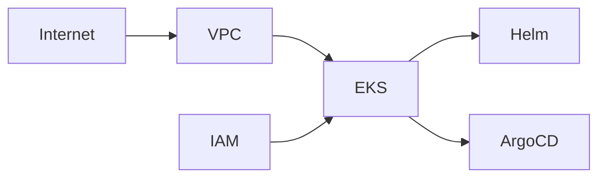

# Terraform infrastructure

This directory is the infrastructure source of truth for the development EKS
environment and its supporting AWS/Kubernetes integrations.

## Quick map

| Area | Terraform location | Current root status |
| --- | --- | --- |
| Networking | [`modules/vpc`](./modules/vpc) | Instantiated |
| EKS control plane and nodes | [`modules/eks`](./modules/eks) | Instantiated |
| IAM roles, users, policies, and attachments | [`modules/iam`](./modules/iam) | Instantiated |
| Helm add-ons and Argo CD | [`main.tf`](./main.tf) | Instantiated |
| Frontend S3 bucket | [`modules/s3`](./modules/s3) | Module exists; not called by root |
| CloudFront CDN | [`modules/cloudfront`](./modules/cloudfront) | Module exists; not called by root |
| WAF and WAF logging | [`modules/waf`](./modules/waf) | Module exists; not called by root |
| CloudWatch WAF log group/policy | [`modules/cloudwatch`](./modules/cloudwatch) | Module exists; not called by root |
| Values consumed by Terraform | [`values`](./values) | Metrics Server values and ALB policy JSON |

## Architecture

The rendered diagrams are kept as Mermaid source so they can be reviewed in
GitHub, VS Code, or any Mermaid-compatible documentation tool:

- [Infrastructure overview](./docs/diagrams/infra-overview.mmd)
- [IAM policy and attachment ER diagram](./docs/diagrams/iam-access.mmd)
- [Architecture notes](./docs/architecture.md)



## Root deployment

The root configuration currently uses:

- VPC CIDR `10.0.0.0/16`
- Two public subnets and two private subnets across `us-east-1a` and
  `us-east-1b`
- A public route through an Internet Gateway
- A private route through a single NAT Gateway
- EKS `dev-eks`, version `1.32`
- One on-demand `t3.medium` node group named `general`, scaling from 0 to 3
- Metrics Server, Cluster Autoscaler, and Argo CD Helm releases
- Argo CD application syncing `backend_v2/overlays/dev` from the repository's
  `main` branch

## IAM policy and attachment inventory

The IAM module creates the following principals:

- Roles: `dev-eks-admin`, `cluster-autoscaler`, and `eks-aws-lbc`
- Users: `developer` and `manager`

Custom policies are created in [`modules/iam/policy`](./modules/iam/policy) and
connected to principals in [`modules/iam/attachment`](./modules/iam/attachment):

| Policy | Attached to | Purpose |
| --- | --- | --- |
| `AmazonEKSAdminPolicy` | `dev-eks-admin` role | Full EKS API access plus constrained `iam:PassRole` |
| `AmazonEKSAssumeAdminPolicy` | `manager` user | Allows `sts:AssumeRole` into the admin role |
| `AmazonEKSDeveloperPolicy` | `developer` user | `eks:DescribeCluster` and `eks:ListClusters` |
| `cluster-autoscaler` | `cluster-autoscaler` role | Reads autoscaling/EC2/EKS state and changes autoscaling capacity |
| `AWSLoadBalancerController` | `eks-aws-lbc` role | Loaded from `values/iam/AWSLoadBalancerController.json` |

The EKS module also attaches AWS-managed policies:

- `AmazonEKSClusterPolicy` and `AmazonEKSServicePolicy` to `eksClusterRole`
- `AmazonEKSWorkerNodePolicy`, `AmazonEKS_CNI_Policy`, and
  `AmazonEC2ContainerRegistryReadOnly` to `eksNodesClusterRole`

EKS access entries map the admin role to Kubernetes group `my-admin` and the
developer user to `developers`.

## Operational notes

1. The S3, CloudFront, WAF, and CloudWatch modules are currently standalone.
   Add root module blocks and pass their outputs/inputs before expecting those
   resources in a plan.
2. The AWS Load Balancer Controller Helm release is commented out in
   [`main.tf`](./main.tf), although its IAM role, policy, and attachment are
   defined.
3. The Argo CD provider currently contains an inline password. Move it to a
   sensitive variable or secret before sharing state or applying from CI.
4. Run Terraform from this directory after configuring AWS credentials and
   the provider backends used by the project:

   ```text
   terraform init
   terraform validate
   terraform plan
   ```
