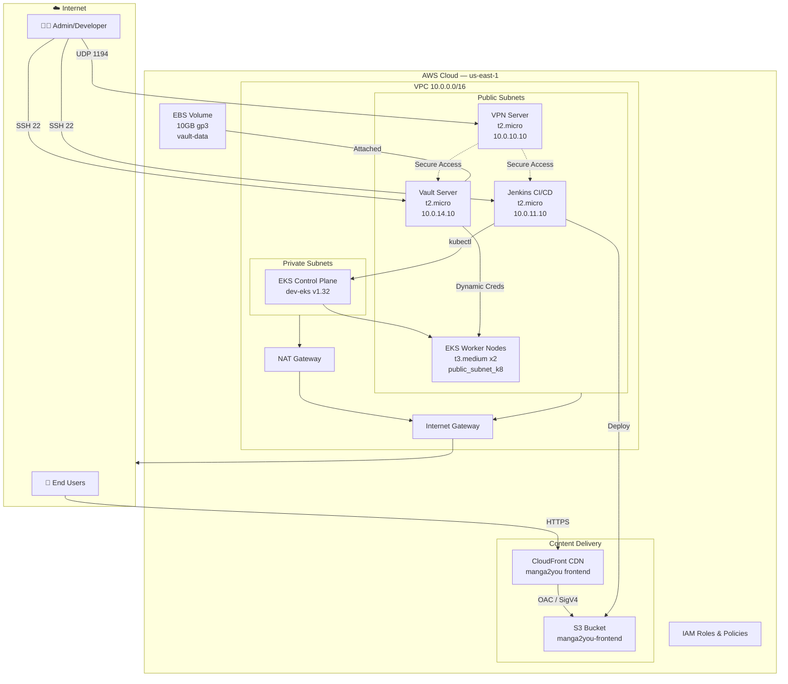
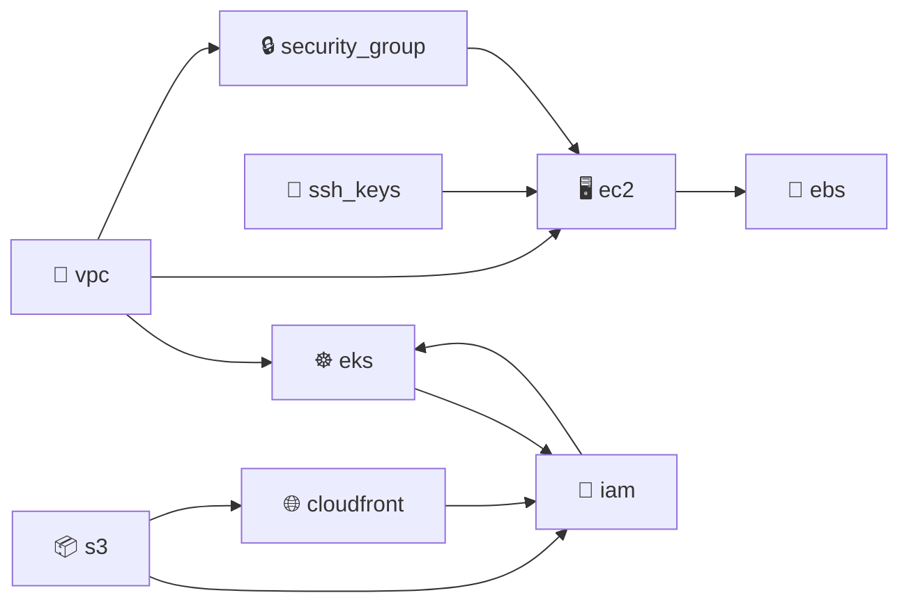
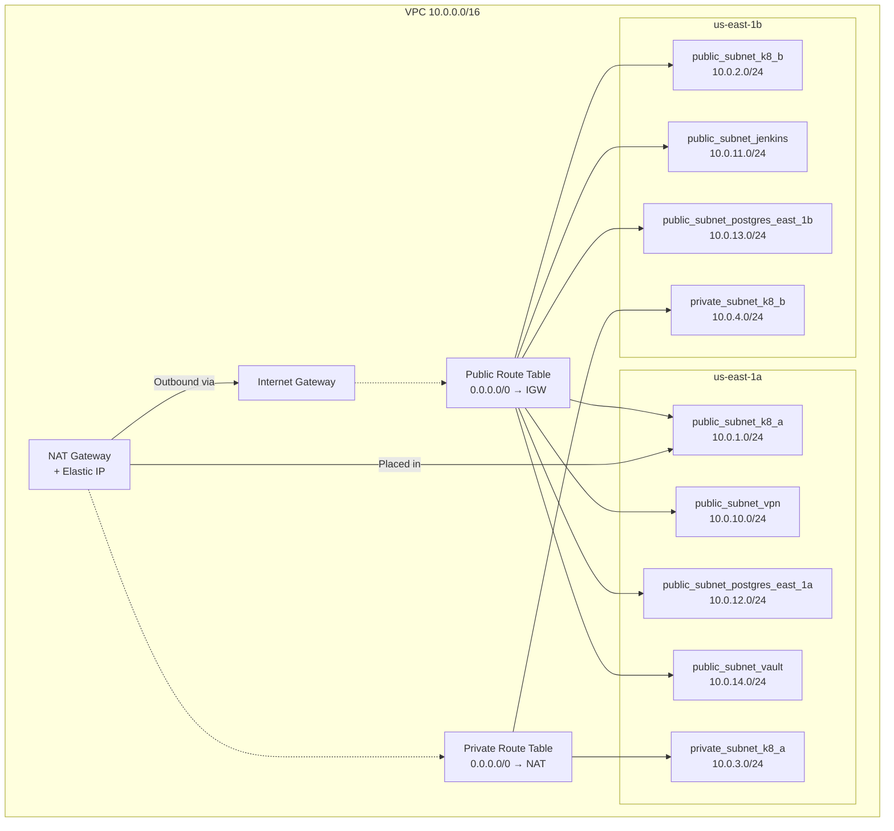
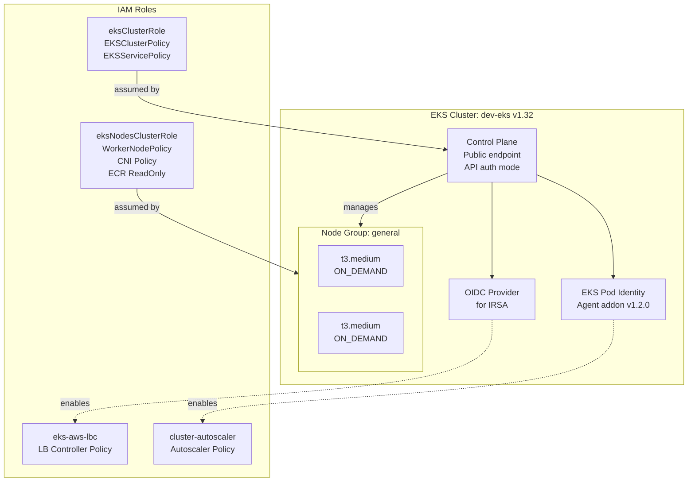
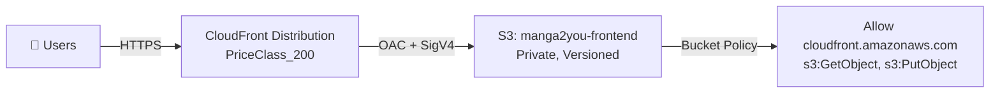
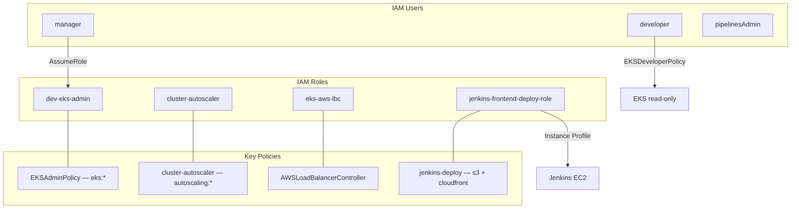

# 🏗️ Manga2You — Terraform Infrastructure Documentation

> **Project**: manga2you (Monolithic DevOps Project)
> **Region**: `us-east-1`
> **EKS Cluster**: `dev-eks` (v1.32)
> **State Backend**: S3 (`backend2you-terraform-state`) with locking

---

## Table of Contents

- [High-Level Architecture](#high-level-architecture)
- [Module Dependency Graph](#module-dependency-graph)
- [Network Architecture (VPC)](#network-architecture-vpc)
- [Subnet Layout](#subnet-layout)
- [Compute — EC2 Instances](#compute--ec2-instances)
- [Kubernetes — EKS Cluster](#kubernetes--eks-cluster)
- [Content Delivery — S3 + CloudFront](#content-delivery--s3--cloudfront)
- [Security — Security Groups](#security--security-groups)
- [IAM — Roles, Policies & Users](#iam--roles-policies--users)
- [Secrets Management — HashiCorp Vault](#secrets-management--hashicorp-vault)
- [Storage — EBS Volumes](#storage--ebs-volumes)
- [Commented-Out / Planned Components](#commented-out--planned-components)
- [Providers & Backend](#providers--backend)
- [Variables & Outputs](#variables--outputs)
- [File Structure](#file-structure)

---

## High-Level Architecture

This is the full picture of the infrastructure. The manga2you project runs a **Kubernetes-based backend** on EKS with a **static frontend** served via CloudFront + S3. A **Jenkins CI/CD server** automates builds and deployments, a **VPN server** provides secure access, and **HashiCorp Vault** manages secrets — all within a single VPC.



---

## Module Dependency Graph

This diagram shows how Terraform modules depend on each other. Arrows mean **"provides output to"**.



---

## Network Architecture (VPC)

**Module**: `modules/vpc/`

The VPC (`10.0.0.0/16`) provides **65,536 IP addresses** and is split into **7 public subnets** and **2 private subnets** across two availability zones.



> **Note:** The NAT Gateway is placed in `public_subnet_k8_a` and provides outbound internet access for resources in private subnets. Public subnets have `map_public_ip_on_launch = true`.

---

## Subnet Layout

| Subnet Name | CIDR Block | AZ | Type | Purpose |
|---|---|---|---|---|
| `public_subnet_k8_a` | `10.0.1.0/24` | us-east-1a | Public | EKS worker nodes |
| `public_subnet_k8_b` | `10.0.2.0/24` | us-east-1b | Public | EKS worker nodes |
| `private_subnet_k8_a` | `10.0.3.0/24` | us-east-1a | Private | EKS control plane |
| `private_subnet_k8_b` | `10.0.4.0/24` | us-east-1b | Private | EKS control plane |
| `public_subnet_vpn` | `10.0.10.0/24` | us-east-1a | Public | OpenVPN server |
| `public_subnet_jenkins` | `10.0.11.0/24` | us-east-1b | Public | Jenkins CI/CD |
| `public_subnet_postgres_east_1a` | `10.0.12.0/24` | us-east-1a | Public | PostgreSQL RDS (AZ1) |
| `public_subnet_postgres_east_1b` | `10.0.13.0/24` | us-east-1b | Public | PostgreSQL RDS (AZ2) |
| `public_subnet_vault` | `10.0.14.0/24` | us-east-1a | Public | HashiCorp Vault |

---

## Compute — EC2 Instances

**Module**: `modules/ec2/`

Three EC2 instances are provisioned, each in its own subnet with a dedicated network interface:

| Instance | Type | Subnet | Private IP | Security Group | IAM Profile | Special |
|---|---|---|---|---|---|---|
| **VPN** | t2.micro | public_subnet_vpn | 10.0.10.10 | vpn_sg | — | OpenVPN, Elastic IP |
| **Jenkins** | t2.micro | public_subnet_jenkins | 10.0.11.10 | jenkins_sg | ec2-instance-profile | CI/CD pipeline |
| **Vault** | t2.micro | public_subnet_vault | 10.0.14.10 | vault_sg | — | EBS mount via user_data |

> **Important:** The Vault instance runs a **user_data script** at boot that waits for the EBS volume (`/dev/xvdf`), formats it as ext4 if new, mounts it at `/mnt/vault-data`, and adds an fstab entry for persistence.

---

## Kubernetes — EKS Cluster

**Module**: `modules/eks/`



| Property | Value |
|---|---|
| Cluster Name | `dev-eks` |
| Version | `1.32` |
| Endpoint Access | Public: ✅ / Private: ❌ |
| Auth Mode | API (bootstrap admin = true) |
| Node Group | `general` — t3.medium, ON_DEMAND |
| Scaling | desired: 1, min: 0, max: 2 |
| Node Subnets | public_subnet_k8_a, public_subnet_k8_b |
| Control Plane Subnets | private_subnet_k8_a, private_subnet_k8_b |
| Addons | EKS Pod Identity Agent v1.2.0 |

---

## Content Delivery — S3 + CloudFront

**Modules**: `modules/s3/` + `modules/cloudfront/`



**How it works:**

1. The **S3 bucket** (`manga2you-frontend`) stores the frontend build artifacts
2. **All public access is blocked** — CloudFront is the only way to access the content
3. **Origin Access Control (OAC)** with SigV4 ensures only CloudFront can read from S3
4. **Versioning** enabled with lifecycle keeping the latest 15 versions
5. **3 cache behaviors**: default, `/content/immutable/*` (long TTL), `/content/*`
6. **Geo-restriction**: US, CA, GB, DE only
7. **Custom error responses** (403/404 → `/index.html`) for SPA routing

---

## Security — Security Groups

**Module**: `modules/security_group/`

| Security Group | Ingress Rules | Applied To |
|---|---|---|
| **vpn_sg** | UDP 1194 from 0.0.0.0/0 (OpenVPN), TCP 22 from Admin IP | VPN instance |
| **jenkins_sg** | TCP 8090 from VPN subnet (10.0.10.0/24), TCP 22 from Admin IP | Jenkins instance |
| **vault_sg** | TCP 8200 from VPN subnet (10.0.10.0/24), TCP 22 from Admin IP | Vault instance |
| **postgres_sg** | TCP 5432 from K8s subnets + Vault subnet | PostgreSQL RDS |

> **Tip:** Admin SSH IP is **auto-detected** via `https://icanhazip.com` at apply time.

---

## IAM — Roles, Policies & Users

**Module**: `modules/iam/` (submodules: `role/`, `policy/`, `user/`, `attachment/`)



---

## Secrets Management — HashiCorp Vault

**Module**: `modules/vault/` (commented out in main.tf)

When enabled, Vault provides **dynamic database credentials**:

1. Vault mounts a `database/` secrets engine
2. Connects to PostgreSQL RDS
3. Creates short-lived `readonly` credentials (TTL: 1h, max: 24h)
4. Applications request creds via `vault read database/creds/readonly`

---

## Storage — EBS Volumes

**Module**: `modules/ebs/`

| Property | Value |
|---|---|
| Size | 10 GiB |
| Type | gp3 (General Purpose SSD) |
| Encryption | Enabled |
| AZ | us-east-1a |
| Device | `/dev/xvdf` |
| Mount Point | `/mnt/vault-data` |
| Attached To | Vault EC2 instance |

---

## Commented-Out / Planned Components

| Component | Module | Purpose |
|---|---|---|
| **PostgreSQL RDS** | `modules/postgreSQL` | db.t3.micro, PostgreSQL 16.4, 20GB |
| **Vault Provider** | `modules/vault` | Dynamic DB credentials |
| **CloudWatch** | `modules/cloudwatch` | WAF logs, alarms, SNS |
| **WAF** | `modules/waf` | Frontend + backend WebACLs |
| **SSO/Users** | `modules/users` | AWS SSO with Identity Store |
| **Metrics Server** | Helm release | Kubernetes HPA metrics |
| **ArgoCD** | Helm + provider | GitOps deployments |
| **Cluster Autoscaler** | Helm release | Node auto-scaling |
| **AWS LB Controller** | Helm release | Kubernetes ALB/NLB |

---

## Providers & Backend

| Provider | Version | Purpose |
|---|---|---|
| **AWS** | ~> 5.35 | Core infrastructure |
| **Helm** | ~> 2.13 | Kubernetes Helm charts |
| **Kubernetes** | ~> 2.30 | K8s resource management |
| **Vault** | — | Secrets management |
| **ArgoCD** | 7.12.4 | GitOps deployments |

**State Backend**: S3 bucket `backend2you-terraform-state` with native S3 locking and AES256 encryption.

---

## Variables & Outputs

### Inputs

| Variable | Type | Sensitive | Description |
|---|---|---|---|
| `argocd_username` | string | ❌ | ArgoCD admin username |
| `argocd_password` | string | ✅ | ArgoCD admin password |
| `deployer_public_key` | string | ✅ | SSH public key for EC2 |
| `db_username` | string | ❌ | PostgreSQL username |
| `db_password` | string | ✅ | PostgreSQL password |
| `db_name` | string | ❌ | PostgreSQL database name |
| `vault_token` | string | ✅ | Vault root token |

### Outputs

| Output | Description |
|---|---|
| `postgres_database_url` | PostgreSQL connection URL (sensitive) |
| `ec2_instances_ip_address` | Map of instance name → public IP |
| `aws_cloudfront_distribution_frontend_id` | CloudFront distribution ID |

---

## File Structure

```
terraform/
├── main.tf                    # Root module — wires all modules
├── variables.tf               # Input variable declarations
├── terraform.tfvars           # Variable values (⚠️ contains secrets!)
├── locals.tf                  # eks_name, eks_version
├── providers.tf               # Provider configs + S3 backend
├── backend.tf                 # State backend resources (commented out)
├── output.tf                  # Root outputs
├── modules/
│   ├── vpc/                   # VPC, subnets, IGW, NAT, route tables
│   ├── ec2/                   # EC2 instances, ENIs, EIP, route tables
│   ├── eks/                   # EKS cluster, node group, OIDC, IAM
│   ├── iam/                   # IAM orchestrator
│   │   ├── role/              #   IAM roles
│   │   ├── policy/            #   IAM policies
│   │   ├── user/              #   IAM users
│   │   └── attachment/        #   Attachments + instance profile
│   ├── s3/                    # Frontend S3 bucket
│   ├── cloudfront/            # CDN distribution + OAC
│   ├── security_group/        # Security groups
│   ├── ssh_keys/              # SSH key pair
│   ├── ebs/                   # Vault EBS volume
│   ├── postgreSQL/            # RDS PostgreSQL (commented out)
│   ├── vault/                 # Vault secrets (commented out)
│   ├── cloudwatch/            # CloudWatch (commented out)
│   ├── waf/                   # WAF WebACLs (commented out)
│   └── users/                 # SSO users (commented out)
├── values/                    # Helm values & IAM policy JSONs
├── docs/                      # Documentation
└── test/                      # Tests
```

> **⚠️ Security Warning:** `terraform.tfvars` contains plaintext secrets. Ensure it's in `.gitignore`.
