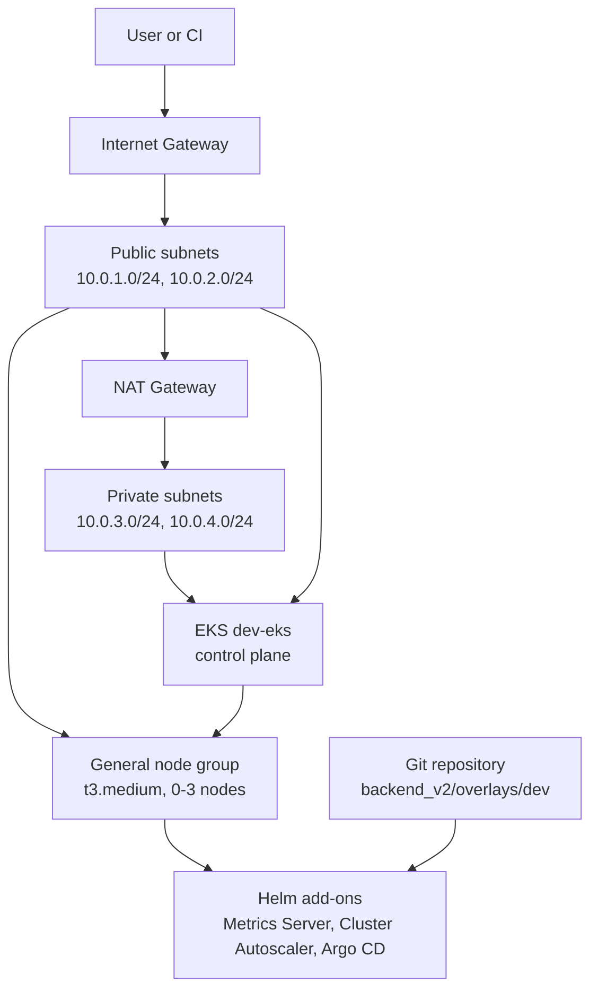
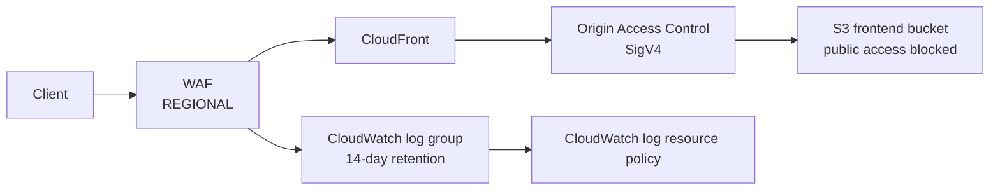

# Infrastructure architecture notes

## Request path and control plane

The EKS API endpoint is public, while the control-plane ENIs are placed in
private subnets. The node group is currently configured with the public subnet
outputs from the VPC module, so the diagram records that behavior rather than
assuming nodes are private.

## Optional AWS edge and observability modules

These modules are present but are not currently reachable from the root module:

The CloudFront module also creates an S3 bucket policy limited to the
CloudFront service principal and the distribution source ARN. The WAF module
redacts the `authorization` header from logs.

## Dependency order

1. VPC creates subnets, route tables, Internet Gateway, EIP, and NAT Gateway.
2. IAM creates EKS and workload roles, users, policies, and attachments.
3. EKS consumes VPC subnet IDs and the Cluster Autoscaler role ARN.
4. Helm and Argo CD providers consume the EKS endpoint, CA data, and auth token.
5. Add-ons and the Argo CD application are installed after the cluster is
   available.

